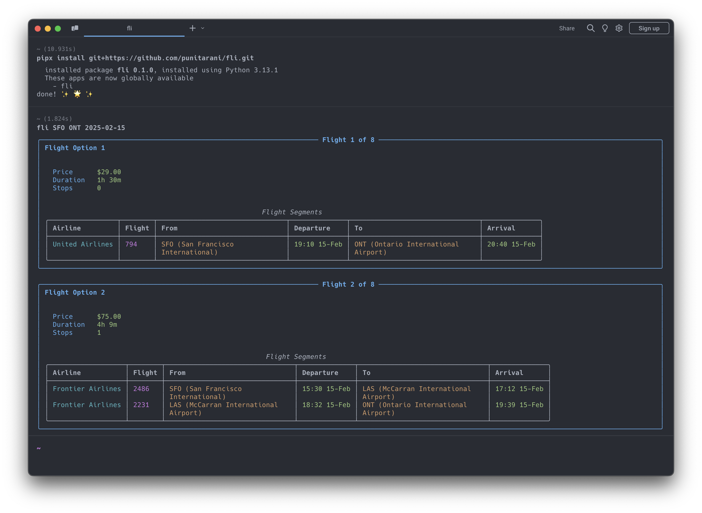

# fli

A Python package for searching flights using Google Flights data. Provides a clean interface for flight searches with
comprehensive filtering options.

## Installation

```bash
pip install git+https://github.com/punitarani/fli.git
```

## CLI Usage

[](data/cli-demo.png)

The package provides a command-line interface for quick flight searches:

```bash
# Basic search
fli JFK LHR 2025-10-25

# Search with time range
fli JFK LHR 2025-10-25 -t 6-20

# Search with specific airlines
fli JFK LHR 2025-10-25 --airlines BA KL

# Full example with all options
fli JFK LHR 2025-10-25 -t 6-20 -a BA KL -s BUSINESS -x NON_STOP -o DURATION
```

### CLI Options

- `-t, --time`: Time range in 24h format (e.g., 6-20)
- `-a, --airlines`: List of airline codes (e.g., BA KL)
- `-s, --seat`: Seat type (ECONOMY, PREMIUM_ECONOMY, BUSINESS, FIRST)
- `-x, --stops`: Maximum stops (ANY, NON_STOP, ONE_STOP, TWO_PLUS_STOPS)
- `-o, --sort`: Sort results by (CHEAPEST, DURATION, DEPARTURE_TIME, ARRIVAL_TIME)

### Help

Get detailed help with:

```bash
fli --help
```

## Python API Usage

You can also use the package programmatically:

```python
from datetime import datetime, timedelta
from fli.models import (
    Airport,
    FlightSegment,
    MaxStops,
    PassengerInfo,
    SeatType,
    SortBy,
)
from fli.search import Search, SearchFilters

# Create search filters
filters = SearchFilters(
    departure_airport=Airport.JFK,
    arrival_airport=Airport.LAX,
    departure_date=(datetime.now() + timedelta(days=30)).strftime("%Y-%m-%d"),
    passenger_info=PassengerInfo(adults=1),
    seat_type=SeatType.ECONOMY,
    stops=MaxStops.NON_STOP,
    sort_by=SortBy.CHEAPEST,
)

# Search flights
search = Search()
flights = search.search(filters)

# Process results
for flight in flights:
    print(f"Price: ${flight.price}")
    print(f"Duration: {flight.duration} minutes")
    print(f"Stops: {flight.stops}")

    for leg in flight.legs:
        print(f"\nFlight: {leg.airline.value} {leg.flight_number}")
        print(f"From: {leg.departure_airport.value} at {leg.departure_datetime}")
        print(f"To: {leg.arrival_airport.value} at {leg.arrival_datetime}")
```

## Features

- **Search Options**:
    - One-way flights
    - Flexible departure times
    - Multiple airlines
    - Various cabin classes
    - Stop preferences
    - Custom sorting

- **Cabin Classes**:
    - Economy
    - Premium Economy
    - Business
    - First

- **Sort Options**:
    - Price
    - Duration
    - Departure Time
    - Arrival Time

- **Built-in Features**:
    - Rate limiting
    - Automatic retries
    - Error handling
    - Beautiful CLI output

## Error Handling

The package includes comprehensive error handling:

- Input validation
- Rate limiting
- Automatic retries for failed requests
- Clear error messages

## Development

```bash
# Install development dependencies
poetry install

# Run tests
poetry run pytest

# Run linting
poetry run ruff check .
poetry run ruff format .
```
